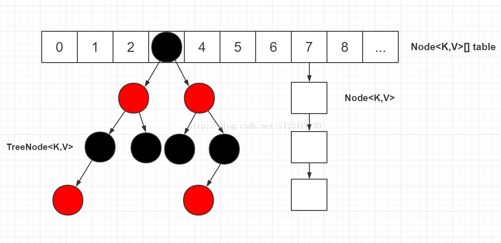

## HashMap数据结构分析

1. 基本组成

   JDK 1.8 以后 HashMap的实现方式改成了 数组+单向链表+红黑树，主要目的是为了提高查找效率。

2. JDK 1.8 以后 HashMap 数据结构图如下， 当链表节点较少时仍然是以链表存在，当链表节点较多时（大于8）会转为红黑树。 

3. 主要源码方法分析

```java
    
	/**
	 * HashMap 中的数组
	 */
	transient Node<K,V>[] table;
	
	/**
	 * 最大的长度，同时必须是二的幂次数
	 * MUST be a power of two <= 1<<30.
	 */
	static final int MAXIMUM_CAPACITY = 1 << 30;
	
	/**
	 * 负载因子
	 */
	int threshold;
	
    public V put(K key, V value) {
        return putVal(hash(key), key, value, false, true);
    }
	
    static final int hash(Object key) {
        int h;
        return (key == null) ? 0 : (h = key.hashCode()) ^ (h >>> 16);
    }
	
	final V putVal(int hash, K key, V value, boolean onlyIfAbsent,
                   boolean evict) {
		// 			   
        Node<K,V>[] tab; 
		Node<K,V> p; 
		int n, i;
		// 判断table是否为null，为null初始化
        if ((tab = table) == null || (n = tab.length) == 0)
            n = (tab = resize()).length;// 初始化后的长度为16
		// 根据hash值找到需要插入的位置，若这个位置为null，则新建一个节点
        if ((p = tab[i = (n - 1) & hash]) == null)
            tab[i] = newNode(hash, key, value, null);
        else {
			// 现有的长度不够，需要扩容
            Node<K,V> e; 
			K k;
			// 先判断找到的位置hash值与传入的hash值是否一致，
			// 一致的话，再判断key是否相等
            if (p.hash == hash &&
                ((k = p.key) == key || (key != null && key.equals(k))))
				// key值相等，直接返回找到的位置的节点
				// 相当于没有发生hash冲突
                e = p;
            else if (p instanceof TreeNode)
				// 发生hash冲突，当前为红黑树
                e = ((TreeNode<K,V>)p).putTreeVal(this, tab, hash, key, value);
            else {
				// 发生hash冲突，当前为链表
                for (int binCount = 0; ; ++binCount) {
                    if ((e = p.next) == null) {
                        p.next = newNode(hash, key, value, null);
                        if (binCount >= TREEIFY_THRESHOLD - 1) // -1 for 1st
						// 数量达到要求，把链表转换为树
                            treeifyBin(tab, hash);
                        break;
                    }
                    if (e.hash == hash &&
                        ((k = e.key) == key || (key != null && key.equals(k))))
                        break;
                    p = e;
                }
            }
            if (e != null) { // existing mapping for key
				// 覆盖这个位置上的旧的值
                V oldValue = e.value;
                if (!onlyIfAbsent || oldValue == null)
                    e.value = value;
                afterNodeAccess(e);
                return oldValue;
            }
        }
        ++modCount;
        if (++size > threshold)
            resize();
        afterNodeInsertion(evict);
        return null;
    }
	
	/**
	 * 初始化，或者左移一位扩容
	 */
	final Node<K,V>[] resize() {
        Node<K,V>[] oldTab = table;
        int oldCap = (oldTab == null) ? 0 : oldTab.length;
        int oldThr = threshold;
        int newCap, newThr = 0;
        if (oldCap > 0) {
		// 老的数组长度大于0
            if (oldCap >= MAXIMUM_CAPACITY) {
				// 老数组长度大于等于最大值
                threshold = Integer.MAX_VALUE;
                return oldTab;
            }
            else if ((newCap = oldCap << 1) < MAXIMUM_CAPACITY &&
                     oldCap >= DEFAULT_INITIAL_CAPACITY)
                newThr = oldThr << 1; // double threshold
        }
        else if (oldThr > 0) // initial capacity was placed in threshold
            newCap = oldThr;
        else {               // zero initial threshold signifies using defaults
            newCap = DEFAULT_INITIAL_CAPACITY;
            newThr = (int)(DEFAULT_LOAD_FACTOR * DEFAULT_INITIAL_CAPACITY);
        }
        if (newThr == 0) {
            float ft = (float)newCap * loadFactor;
            newThr = (newCap < MAXIMUM_CAPACITY && ft < (float)MAXIMUM_CAPACITY ?
                      (int)ft : Integer.MAX_VALUE);
        }
        threshold = newThr;
        @SuppressWarnings({"rawtypes","unchecked"})
        Node<K,V>[] newTab = (Node<K,V>[])new Node[newCap];
        table = newTab;
        if (oldTab != null) {
            for (int j = 0; j < oldCap; ++j) {
                Node<K,V> e;
                if ((e = oldTab[j]) != null) {
                    oldTab[j] = null;
                    if (e.next == null)
                        newTab[e.hash & (newCap - 1)] = e;
                    else if (e instanceof TreeNode)
                        ((TreeNode<K,V>)e).split(this, newTab, j, oldCap);
                    else { // preserve order
                        Node<K,V> loHead = null, loTail = null;
                        Node<K,V> hiHead = null, hiTail = null;
                        Node<K,V> next;
                        do {
                            next = e.next;
                            if ((e.hash & oldCap) == 0) {
                                if (loTail == null)
                                    loHead = e;
                                else
                                    loTail.next = e;
                                loTail = e;
                            }
                            else {
                                if (hiTail == null)
                                    hiHead = e;
                                else
                                    hiTail.next = e;
                                hiTail = e;
                            }
                        } while ((e = next) != null);
                        if (loTail != null) {
                            loTail.next = null;
                            newTab[j] = loHead;
                        }
                        if (hiTail != null) {
                            hiTail.next = null;
                            newTab[j + oldCap] = hiHead;
                        }
                    }
                }
            }
        }
        return newTab;
    }
```

